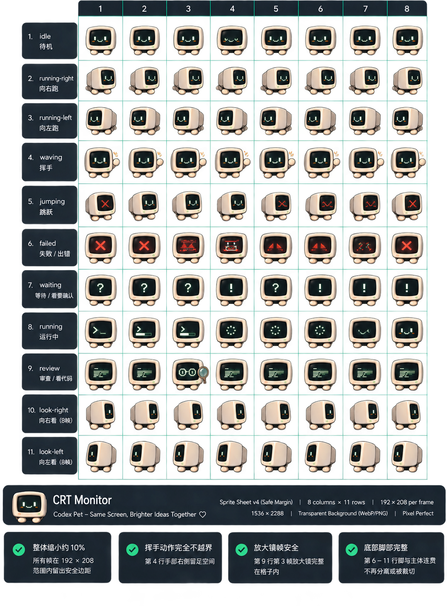

<div align="center">

# Codex Pet 宠物集合

### 在同一个仓库中维护的原创 Codex 桌面伙伴。

简体中文 · [English](README.md)



**Codex Pet v2** · **支持多宠物** · **macOS / Windows / Linux**

</div>

这里统一维护原创 Codex Pet 的运行包、原始美术、预览图、审计结果和维护工具。每只宠物都完整存放在 `pets/<pet-id>/`，并在 `catalog.json` 中登记。

## 宠物

| 宠物 | 状态 | 预览 |
| --- | --- | --- |
| [CRT Monitor](pets/crt-monitor/README.md) | 稳定 · 已审计 88 帧 | [8×11 Contact sheet](pets/crt-monitor/assets/preview-grid.png) |

机器人头宠物仍处于设计阶段，目前尚未加入运行时目录。

## 安装

先在 [catalog.json](catalog.json) 查看宠物 id，再安装指定宠物：

```bash
./scripts/install.sh crt-monitor
```

Windows PowerShell：

```powershell
./scripts/install.ps1 -PetId crt-monitor
```

重启 Codex，然后在 **Settings → Appearance → Pets** 中选择宠物。不传 id 时仍默认安装 CRT Monitor，以兼容原有用法。

## 验证

```bash
python3 scripts/validate.py --all
```

为指定宠物生成原生分辨率 Contact sheet 和逐帧审计：

```bash
python3 scripts/generate-preview-and-audit.py crt-monitor
```

新增宠物前请阅读[仓库结构说明](docs/ARCHITECTURE.md)。

## 兼容性

原有根目录 `pet/` 运行文件和部分 `assets/` 素材会继续作为 CRT Monitor 的逐字节兼容镜像保留，因此外部链接（包括现有 Awesome Codex Pet 条目）不会失效。新宠物只使用规范的 `pets/<pet-id>/` 结构。

## 许可证

代码和脚本采用 [MIT License](LICENSE)。每只宠物单独声明美术许可证；CRT Monitor 使用 [CC BY 4.0](pets/crt-monitor/LICENSE-ARTWORK)。

---

<div align="center">
<sub>这是独立的社区项目，与 OpenAI 无隶属或官方背书关系。</sub>
</div>
