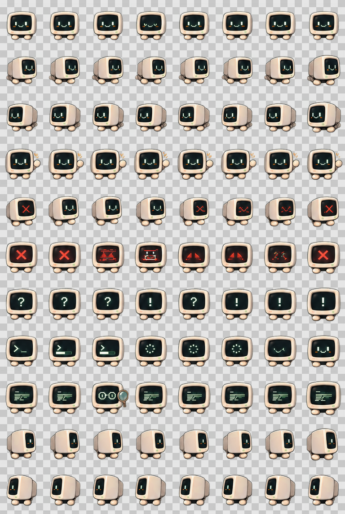

# CRT Monitor — Codex Pet

一台会盯着你代码看的复古小显示器。



**Codex Pet v2 · 88 帧动画 · 透明 WebP · macOS / Windows / Linux · 原创角色**

CRT Monitor 是为 Codex 设计的原创 Q 版 CRT 桌面宠物。屏幕会随运行状态变化：工作时显示终端/进度，等待时显示问号或感叹号，失败时显示错误诊断，Review 时显示代码内容，v2 的最后两行则用于方向观察动作。

## 安装

### macOS / Linux

```bash
./scripts/install.sh
```

也可以手动复制：

```bash
mkdir -p ~/.codex/pets/crt-monitor
cp pet/pet.json pet/spritesheet.webp ~/.codex/pets/crt-monitor/
```

重启 Codex，然后在 **Settings → Appearance → Pets** 中选择 **CRT Monitor**。

### Windows PowerShell

```powershell
./scripts/install.ps1
```

## 精灵图规格

| 项目 | 数值 |
| --- | --- |
| 版本 | Codex Pet v2 |
| Atlas | `1536 × 2288` WebP |
| 网格 | `8 × 11` |
| 单帧 | `192 × 208` |
| 标准动画行 | 9 |
| 观察方向行 | 2 |
| 透明度 | RGBA / 透明 WebP |

最终确认的设计稿采用 9 列工作布局；正式 Codex atlas 使用其中有编号的前 8 帧，并统一映射到 Codex 所需的 8 列格式，不对单个角色做独立自动缩放。

## 验证

```bash
python3 scripts/validate.py
```

脚本会检查 atlas 尺寸、8×11 网格、运行时 manifest、透明通道以及基础边界安全。

## 向社区投稿

Awesome Codex Pet 社区要求目录命名为：

```text
pets/<pet-slug>--<author-slug>/
```

并且目录中只能包含：

```text
submission.json
pet.json
spritesheet.webp
```

用你的 GitHub 用户名生成投稿包：

```bash
python3 scripts/prepare-community-submission.py YOUR_GITHUB_HANDLE
```

生成目录：

```text
community/generated/crt-monitor--YOUR_GITHUB_HANDLE/
```

发 PR 前请检查 `submission.json` 中的作者信息与仓库 URL。

## 参与贡献

欢迎改进动画连续性、屏幕表情、无障碍表现、文档、安装脚本以及兼容的视觉变体。

对主宠物进行贡献时，建议保持 CRT 的核心轮廓和各状态含义。较大的视觉重设计更适合作为独立 variant。

## 许可证

代码和脚本：**MIT**，见 [LICENSE](LICENSE)。

角色设计和精灵图：**CC BY 4.0**，见 [LICENSE-ARTWORK](LICENSE-ARTWORK)。
